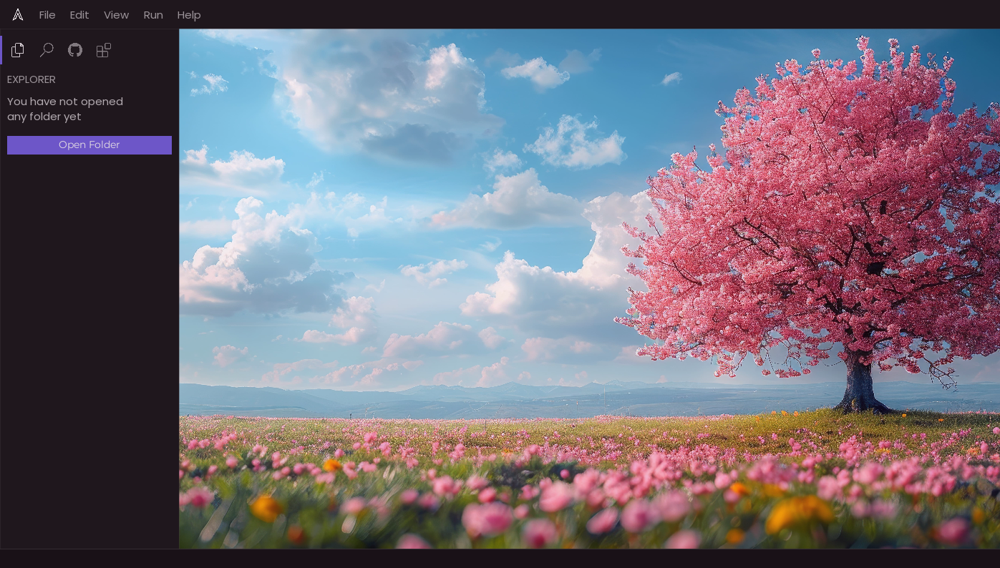
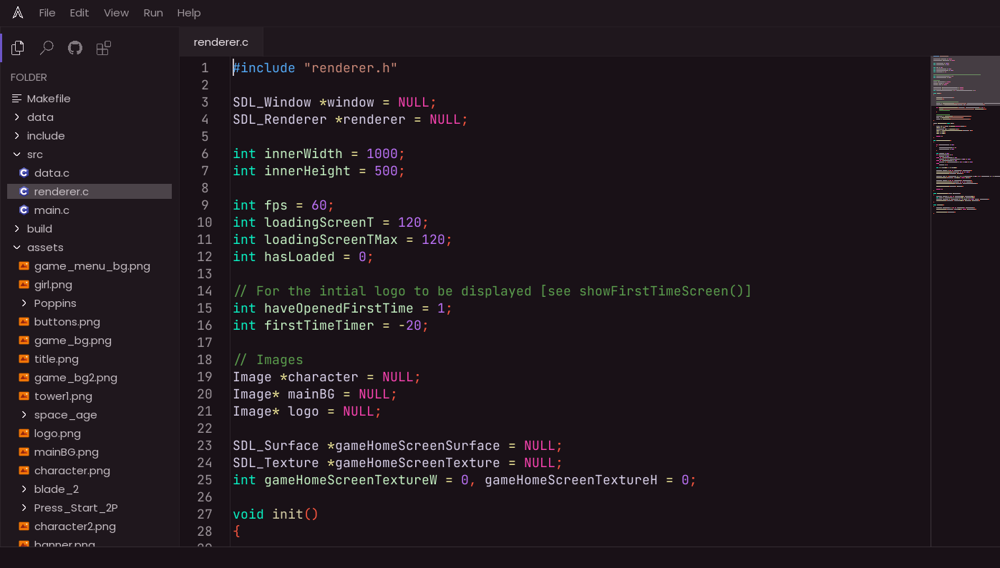

# Aether

A modern, lightweight code editor built from scratch in C using SDL3. This project provides a fast, efficient, and customizable text editing experience with a graphical user interface.

## Table of Contents
- [Features](#features)
- [Screenshots](#screenshots)
- [Architecture](#architecture)
- [Requirements](#requirements)
- [Installation](#installation)
- [Building from Source](#building-from-source)
- [Usage](#usage)
- [Project Structure](#project-structure)
- [Configuration](#configuration)
- [Contributing](#contributing)
- [License](#license)

## Features

- **Modern GUI**: Clean, responsive interface built with SDL3
- **File Explorer**: Built-in file browser with folder navigation
- **Syntax Highlighting**: Support for multiple programming languages
- **Multi-tab Interface**: Work with multiple files simultaneously
- **Customizable Interface**: Adjustable themes and layout
- **Real-time Editing**: Fast text rendering and editing capabilities
- **Cross-platform**: Runs on Linux, Windows, and macOS
- **Lightweight**: Minimal resource usage and fast startup times
- **Extensible**: Modular architecture for easy feature additions

## Screenshots

*Main editor interface with file explorer*


*Multiple files open in tabs*


*Syntax highlighting in action*

## Architecture

The editor follows a modular architecture with clear separation of concerns:

- **Renderer Module**: Handles all SDL3 graphics operations
- **Events Module**: Manages user input and event handling
- **Files Module**: File I/O operations and folder management
- **Parser Module**: Text parsing and syntax highlighting
- **Utils Module**: Common utilities and helper functions

## Requirements

### Runtime Dependencies
- SDL3
- SDL3_image
- SDL3_ttf
- GTK3 (for file dialogs, if used)

### Build Dependencies
- GCC or Clang compiler
- CMake (>= 3.16)
- pkg-config

### Fonts Included
- **JetBrains Mono**: For code editing (monospace)
- **Poppins**: For UI elements
- **Montserrat**: For headings and labels

## Installation

### Ubuntu/Debian
```bash
# Note: SDL3 packages might not be in the default repositories yet.
# You may need to compile SDL3 from source.
sudo apt update
sudo apt install build-essential cmake pkg-config
```

### Fedora/RHEL
```bash
sudo dnf install cmake gcc make
```

### Arch Linux
```bash
# SDL3 is available in AUR or some repos
sudo pacman -S cmake gcc make
```

### macOS
```bash
brew install cmake sdl3 sdl3_image sdl3_ttf
```

## Building from Source

1. **Clone the repository**:
   ```bash
   git clone https://github.com/7777Satish/Aether.git
   cd Aether
   ```

2. **Create build directory**:
   ```bash
   mkdir build
   cd build
   ```

3. **Configure the project**:
   ```bash
   cmake ..
   ```

4. **Build the project**:
   ```bash
   make
   ```

5. **Run the editor**:
   ```bash
   ./editor
   ```

### Build Options
- `cmake -DCMAKE_BUILD_TYPE=Debug ..`: Build with debug symbols
- `make clean`: Remove build artifacts (or just delete build folder)
- `sudo make install`: Install to system (if configured in CMake)

## Usage

### Starting the Editor
```bash
# Start with empty workspace
./build/editor

# Open a specific file
./build/editor filename.c

# Open a project folder
./build/editor /path/to/project
```

### Key Features

#### File Management
- **Open Folder**: Click the folder icon in the explorer panel
- **Create New File**: File → New File or Ctrl+N
- **Save File**: File → Save or Ctrl+S
- **Open File**: File → Open or Ctrl+O

#### Navigation
- **File Explorer**: Browse and open files from the left panel
- **Tab Navigation**: Click tabs or use Ctrl+Tab
- **Quick Search**: Use the search panel for finding text

#### Editing
- **Syntax Highlighting**: Automatic detection based on file extension
- **Multi-cursor**: Hold Ctrl while clicking for multiple cursors
- **Auto-indent**: Automatic indentation for code blocks

## Project Structure

```
Aether/
├── src/                    # Source code
│   ├── main.c             # Main application entry point
│   ├── renderer.c         # SDL2 rendering and UI
│   ├── events.c           # Event handling and input
│   ├── files.c            # File operations and explorer
│   ├── parser.c           # Text parsing and syntax highlighting
│   └── utils.c            # Utility functions
├── include/               # Header files
│   ├── renderer.h         # Rendering declarations
│   ├── events.h           # Event handling declarations
│   ├── files.h            # File operations declarations
│   ├── parser.h           # Parser declarations
│   └── utils.h            # Utility declarations
├── assets/                # Resources
│   ├── fonts/             # Font files
│   ├── icons/             # UI icons
│   ├── screenshots/       # Project screenshots
│   └── themes/            # Color themes
├── build/                 # Compiled objects and executable
├── docs/                  # Documentation
├── Makefile              # Build configuration
├── config.json           # Editor configuration
└── README.md             # This file
```

## Configuration

The editor can be customized through `config.json`:

```json
{
  "theme": "dark",
  "font_size": 14,
  "tab_size": 4,
  "word_wrap": true,
  "syntax_highlighting": true,
  "auto_save": false,
  "line_numbers": true
}
```

### Available Themes
- `dark` (default)
- `light`
- `monokai`
- `solarized`

## Contributing

We welcome contributions! Please see our [Contributing Guide](docs/CONTRIBUTING.md) for details.

### Development Setup
1. Fork the repository
2. Create a feature branch: `git checkout -b feature-name`
3. Make your changes
4. Test thoroughly
5. Submit a pull request

### Code Style
- Follow K&R C style guidelines
- Use meaningful variable names
- Add comments for complex logic
- Ensure proper error handling

### Reporting Issues
Please use the GitHub issue tracker to report bugs or request features.

## License

This project is licensed under the MIT License - see the [LICENSE](LICENSE) file for details.

## Acknowledgments

- SDL2 development team for the excellent graphics library
- Font authors: JetBrains, Google (Poppins), and Julieta Ulanovsky (Montserrat)
- Contributors and testers

---

**Made with ❤️ by [7777Satish](https://github.com/7777Satish)**